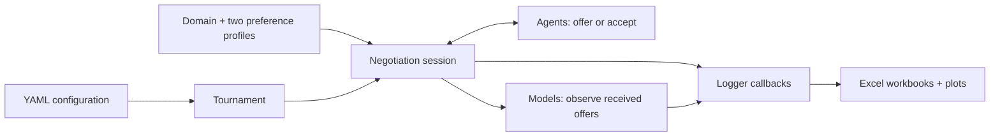

# NegoLog

**A Python framework for bilateral automated negotiation and opponent-model assessment.**

Develop bidding and acceptance strategies, estimate an opponent's preferences,
and evaluate both through configurable tournaments. NegoLog combines
an extensible negotiation environment, bundled agents and domains, Excel logs,
plots, and a local web interface.

[Quickstart](#quickstart) · [Web interface](#web-interface) ·
[Built-in components](#built-in-components) · [Extend NegoLog](#extend-negolog) ·
[Documentation](docs-source/README.md) · [Contributing](CONTRIBUTING.md) ·
[Migration notes](MAINTENANCE.md) · [IJCAI 2024 paper](https://www.ijcai.org/proceedings/2024/998)

> **Updating an existing project?** Read [MAINTENANCE.md](MAINTENANCE.md) first.
> `EstimatedPreference` is now abstract, base models initialize with uniform
> weights, and several model and agent policies have changed. This branch should
> not be treated as a drop-in reproduction of experiments from earlier commits.

## Quickstart

Use **Python 3.10** and run the following commands from a terminal. The dependency
versions in [requirements.txt](requirements.txt) target that interpreter.

```sh
git clone https://github.com/aniltrue/NegoLog.git
cd NegoLog
python3.10 -m venv .venv
source .venv/bin/activate
python -m pip install -r requirements.txt
python run.py tournament_configurations/quickstart.yaml
```

Already have a checkout? Start with the virtual-environment step in its root.
On Windows PowerShell, create the environment with `py -3.10 -m venv .venv`
and activate it with `.\.venv\Scripts\Activate.ps1`.

The [quickstart configuration](tournament_configurations/quickstart.yaml) runs
**BoulwareAgent and ConcederAgent in two sessions**, swapping their roles on the
bundled domain `0` (27 possible bids). Each session has a 20-round limit. Two
opponent models observe the negotiations, and three loggers record outcomes,
bid-space distances and estimation accuracy. This is a small functional example,
not a performance benchmark.

> A tournament replaces the contents of its configured `result_dir` when it
> starts. The example uses `results/quickstart`; change that path before running
> again if you want to retain the earlier output.

### Read the results

The quickstart writes:

```text
results/quickstart/
├── domains.xlsx                 # Domain metadata used in this run
├── results.xlsx                 # One outcome row per session + logger sheets
├── results_backup.xlsx          # Snapshot before tournament-level analysis
├── summary.xlsx                 # Per-agent outcome summaries
├── sessions/
│   ├── Boulware_Conceder_Domain0.xlsx
│   └── Conceder_Boulware_Domain0.xlsx
└── opponent model/
    ├── estimator_summary.xlsx   # Final estimation statistics
    └── ...                     # RMSE and rank-correlation PNGs + CSV data
```

Open `results.xlsx` for outcomes, `summary.xlsx` for agent comparisons, and the
session workbooks for individual offers and model measurements. An agreement is
one possible outcome; a deadline without agreement is also a valid session
result. Each outcome's `FilePath` identifies its session workbook; repeated
pairings keep separate files with `_repeat2`, `_repeat3`, ... suffixes.
Depending on the platform, the CLI opens the results folder when it finishes.

### Configure a tournament

Copy `quickstart.yaml` and change the fields below. Built-in class names resolve
through the registries; custom components can use a full Python path such as
`my_loggers.SampledMetrics`.

| Setting | Meaning |
| --- | --- |
| `agents` | Negotiating strategies. Both role orders are included. |
| `domains` | Quoted domain identifiers, e.g. `["0", "1"]`, from [domains/](domains/). Each domain contains the two preference profiles. |
| `estimators` | Models attached to each agent for observation and assessment. Use `[]` to omit them. |
| `loggers` | Analyses to run. `TournamentSummaryLogger` uses distance columns supplied by `BidSpaceLogger`; the example includes both. |
| `deadline_round`, `deadline_time` | A positive round limit and/or time limit in seconds. Use `null` for the unused limit; at least one must be set. |
| `self_negotiation`, `repeat` | Whether to include same-agent pairings, and how many times to run each pairing. |
| `result_dir` | Output directory, replaced at the start of the run. |
| `seed`, `shuffle` | Random seed and whether to shuffle the session schedule. See [reproducibility](#validation-and-reproducibility). |
| `drawing_format` | `matplotlib-PNG`, `matplotlib-SVG`, or `plotly`. |

The CLI and web interface use the same configuration loader. Unknown fields,
invalid component classes and nonpositive deadlines are rejected; round limits
must be integers. A single-agent tournament requires `self_negotiation: true`.
Selected domains must have catalog entries and readable profiles before an
existing result directory is replaced. Project source/input directories and
ancestor directories cannot be used as tournament output destinations.

The full bid space grows as the product of the number of values per issue.
Start with small domains: bid enumeration, bid-space analysis, and per-offer
assessment can be expensive even when a session has few rounds.

## Web interface

From the repository root, with the same environment activated:

```sh
python app.py
```

Open **<http://127.0.0.1:5000>**. To choose another port:

```sh
python app.py -p 5001
```

The local interface supports domain generation and editing, tournament
configuration, and run monitoring. The React build is included in
[web_framework/](web_framework/), so launching the interface does not require a
Node.js build. Keep the Flask development server local; it is a desktop research
interface, not an authenticated multi-user service. Stop it with `Ctrl+C`.

The web interface runs one tournament at a time because random streams and
plotting settings are process-wide. Finish the active run before changing domains
or starting another.
Unexpected tournament-level failures are reported as `Error` with an explanation;
an individual session that reaches its deadline without agreement remains a
normal `Failed` outcome. Cancellation requested before startup is retained and
does not replace earlier results.

### Create and edit domains

The domain editor's preview (`save: false`) updates the preview image without
changing the stored profiles or domain catalog. Saving updates the existing
catalog entry instead of adding a duplicate; creation and deletion also keep
the catalog synchronized. Saved profiles use the same normalized utilities as
their generated bid-space statistics.

For Python scripts, [generate_domain and generate_random_domain](domain_generator/domain_generator.py)
accept the keyword-only `output_dir` argument. An alternate directory keeps the
generated domain files separate from bundled inputs. Generation is staged:
failure retains an existing domain, while successful generation replaces that
domain's folder. The web interface manages catalog registration; calling a
generator directly returns metadata and does not register it in the web catalog.
Domain folders and catalog workbooks are replaced atomically in separate steps;
ordinary catalog write or rename failures restore the prior domain. Process
interruption between these steps is not covered by a single atomic transaction.

Random generation validates the requested ranges and leaves the caller's range
lists unchanged. It stops with an error after `max_attempts=1000` unsuccessful
candidates by default; infeasible constraints raise `ValueError` instead of
silently widening the ranges. Bounded issue-weight normalization uses integer
hundredths, so the same seed can produce a different domain than older versions.
This bounds candidate attempts, not the cost of enumerating a large bid space.
Undefined normalized balance scores are stored as JSON `null`.

## How the pieces fit



The [`nenv`](nenv/) library represents discrete multi-issue bids and additive
utility profiles. A session alternates offers and acceptance decisions between
two agents. The framework passes each received offer to that agent's configured
estimators; loggers can compare the resulting estimates against the opponent's
true profile for evaluation.

**Strategy quality and model accuracy are separate questions.** Adding a model
to `estimators` does not automatically make an agent use it to choose offers.
An agent must explicitly use an opponent model in its policy. Evaluation loggers
have access to both true profiles; an agent's strategy receives its own profile.

| Code | Responsibility |
| --- | --- |
| [nenv/Agent.py](nenv/Agent.py) | Agent interface and received-offer handling |
| [nenv/Session.py](nenv/Session.py), [SessionManager.py](nenv/SessionManager.py) | Session lifecycle, deadlines and component setup |
| [nenv/Tournament.py](nenv/Tournament.py) | Domain/pairing schedule and tournament output |
| [nenv/OpponentModel/](nenv/OpponentModel/) | Preference estimation and model-assessment APIs |
| [nenv/logger/](nenv/logger/) | Session and tournament analysis callbacks |
| [agents/](agents/), [domains/](domains/) | Bundled strategies and preference profiles |
| [tests/](tests/) | Numerical, migration, logging and integration checks |

## Built-in components

### Nine opponent models

Use these exact class names in the `estimators` list. The
[model registry](nenv/OpponentModel/__init__.py) is the source of truth.

| Class | Estimation approach / relevant distinction |
| --- | --- |
| `ClassicFrequencyOpponentModel` | Frequency-based issue and value weighting |
| `WindowedFrequencyOpponentModel` | Frequency observations with a 25-offer comparison window |
| `BayesianOpponentModel` | Weight/evaluation hypotheses with a deadline-scaled concession assumption |
| `ConflictBasedOpponentModel` | Offer comparisons, conflicts and preference ordering |
| `CUHKOpponentModel` | Value frequencies with equal issue weights; counting continues beyond 100 distinct bids |
| `CUHKFrequencyOpponentModel` | Adapter for the public CUHK agent helper's counting rule; value-count updates stop at the 101st distinct bid |
| `StepwiseCOMBOpponentModel` | Weight/evaluation hypotheses using consecutive-offer utility differences |
| `ExpectationCOMBOpponentModel` | Weight/evaluation hypotheses using a historical-mean comparison |
| `RegressionCOMBOpponentModel` | Weight/evaluation hypotheses using time/utility regression and a deadline-scaled window |

The two CUHK classes implement different update contracts. Neither is an alias
for the complete `CUHKAgent` strategy. See the [model notes](MAINTENANCE.md#opponent-models)
and [adapter policy](MAINTENANCE.md#public-cuhk-frequency-adapter) before comparing them.
These descriptions identify implemented behavior, not measured performance rankings.

### 26 negotiating agents

The [agent registry](agents/__init__.py) exports the following class names:

```text
AgentBuyog               AgentGG                 AgentKN
AhBuNeAgent              Atlas3Agent             BoulwareAgent
Caduceus                 Caduceus2015            ConcederAgent
CUHKAgent                HardHeaded              HybridAgent
HybridAgentWithOppModel  IAMhaggler              Kawaii
LinearAgent              LuckyAgent2022          MICROAgent
NiceTitForTat            ParsAgent               ParsCatAgent
PonPokoAgent             RandomDance             Rubick
SAGAAgent                YXAgent
```

Individual implementations retain their source references and attributions.
See [agent behavior changes](MAINTENANCE.md#existing-agents) when migrating
an existing comparison.

## Assess opponent models

The Python API can evaluate an estimator independently of a full tournament.
This example uses a bundled profile as evaluation ground truth and one
illustrative observation:

```python
from nenv import Preference
from nenv.OpponentModel import BayesianOpponentModel

own = Preference("domains/domain0/profileA.json")
truth = Preference("domains/domain0/profileB.json")
model = BayesianOpponentModel(own, deadline_round=20)
model.update(truth.bids[0], t=0.0)

rmse, spearman, kendall = model.calculate_error(truth)
extra = model.calculate_additional_metrics(truth, pearson=True, mape=True)
```

`calculate_error` returns the existing three-value tuple. Correlations compare
utilities of the same bids and preserve ties. A constant estimate, such as an
unobserved uniform model, has undefined rank correlation (`NaN`), not perfect
accuracy. Preserve that distinction when aggregating results.

Two options are explicit opt-ins:

- `calculate_error(truth, vectorized=True)` enables additive batch evaluation
  for supported standard preferences; custom utility implementations fall back
  to scalar evaluation. No persistent utility cache is introduced.
- `calculate_additional_metrics` returns only requested named statistics.
  Pearson is undefined for constant vectors. MAPE is a percentage and returns
  `NaN` if any true utility is zero; `zero_utility="raise"` requests an error.
  These options do not add columns to existing loggers automatically.

### Choose the measurement cost

`EstimatorMetricLogger` evaluates every offer by default.
`EstimatorOnlyFinalMetricLogger` evaluates at the end of a session. To sample
per-round metrics in a YAML tournament, save this as `my_loggers.py` in the
repository root:

```python
from nenv.logger import EstimatorMetricLogger


class SampledMetrics(EstimatorMetricLogger):
    def __init__(self, log_dir):
        super().__init__(log_dir, sample_every=5)
```

Replace `EstimatorMetricLogger` with `my_loggers.SampledMetrics` in the YAML's
`loggers` list. This measures offers from both sides in rounds 0, 5, 10, ...,
plus the terminal state. Models still receive every offer. Sampling includes
explicit `Round` and `Action` keys; class-based YAML configuration cannot pass
constructor keyword arguments directly.

The [sampling and sparse-log notes](MAINTENANCE.md#optional-sampling-and-round-keys)
explain replay requirements and the opt-in `ExcelLog.save(..., sparse_sheets=...)`
API. Keep default dense output when using consumers that depend on row alignment.

## Extend NegoLog

Custom components use the same interfaces as the bundled implementations:

| Component | Required implementation | Starting point |
| --- | --- | --- |
| Agent | `name` property, `initiate(opponent_name)`, `receive_offer(bid, t)`, `act(t)` returning an `Offer` or `Accept` | [ConcederAgent](agents/conceder/Conceder.py) |
| Opponent model | `name` property and `update(bid, t)`; the base class supplies `preference` | [ClassicFrequencyOpponentModel](nenv/OpponentModel/ClassicFrequencyOpponentModel.py) |
| Logger | Override the callbacks needed for the analysis; return sheet-to-column mappings for log rows | [BidSpaceLogger](nenv/logger/BidSpaceLogger.py) |

For agents, initialize per-session state in `initiate`; `terminate` is an
optional cleanup hook. Do not update framework-managed estimators again in
`receive_offer`, because received-offer handling already updates them.
Use distinct component display names so logs can identify their results.

Custom models should call the base constructor and support
`set_deadline(deadline_round)` before observations. Round-limited sessions pass
the actual horizon; time-only sessions and standalone models default to 1000
rounds. Instantiate `UniformEstimatedPreference` or `CBOMEstimatedPreference`
when a concrete estimated profile is needed; `EstimatedPreference` itself is
abstract. The [migration guide](MAINTENANCE.md#preference-api-migration) describes
initialization choices and the changed contract.

## Current documentation

[docs-source/](docs-source/README.md) contains focused guides and the current
public API reference. Follow its build instructions to generate HTML from the
checked-out `nenv` code in a separate Python 3.10 documentation environment.
The [documentation workflow](.github/workflows/docs.yml) builds a review artifact;
it does not deploy a website.

The checked-in HTML in [docs/](docs/README.md) is an older snapshot and omits
new models and API changes. Use the current sources, this README and
[MAINTENANCE.md](MAINTENANCE.md) when working with this revision. Contribution
and validation steps are in [CONTRIBUTING.md](CONTRIBUTING.md).

## Validation and reproducibility

Run the local tests with the same Python 3.10 environment:

```sh
python -m pip install "pytest>=8.4,<9"
python -m pytest -q tests
```

The tests exercise numerical fixtures, model and agent behavior, logging, and
component integration. Passing them establishes those checked behaviors; it does
not establish published-paper equivalence, universal agent robustness, or a
performance advantage over another framework.

The [test workflow](.github/workflows/tests.yml) runs the same suite on Python
3.10 with Linux, Windows and macOS runners. Runtime checks include callback
failures, repeated-session files, cached bid integrity and web entry points.

Rule-specific lint comments identify intentional test assertions, expected
abstract-class failures, exact-type compatibility guards and legacy attribute
names. Multiline docstrings use a first-line summary; local `D213` exceptions
resolve the conflicting second-line convention. These comments do not disable
the analyzers or skip the tests.

For an experiment, retain the Git commit, YAML configuration, input profiles,
Python/dependency versions, seed and output directory. The YAML seed sets the
framework's Python and NumPy random streams; it is not a guarantee of bitwise
reproduction across agents, machines or wall-clock deadlines. Some agents manage
their own randomness. Prefer explicit round limits for small deterministic checks
and record role order and repetition when interpreting comparisons.

Per-offer metrics can affect elapsed time in time-limited sessions. Undefined
correlations can propagate through summaries, and some historical model display
names exceed Excel's 31-character worksheet limit. Further migration and known
limitations are documented in [MAINTENANCE.md](MAINTENANCE.md#validation).

## Citation

If NegoLog supports your research, please cite the
[IJCAI 2024 Demo Track paper](https://www.ijcai.org/proceedings/2024/998):

```bibtex
@inproceedings{ijcai2024p998,
  title     = {NegoLog: An Integrated Python-based Automated Negotiation Framework with Enhanced Assessment Components},
  author    = {Doğru, Anıl and Keskin, Mehmet Onur and Jonker, Catholijn M. and Baarslag, Tim and Aydoğan, Reyhan},
  booktitle = {Proceedings of the Thirty-Third International Joint Conference on
               Artificial Intelligence, {IJCAI-24}},
  publisher = {International Joint Conferences on Artificial Intelligence Organization},
  editor    = {Kate Larson},
  pages     = {8640--8643},
  year      = {2024},
  month     = {8},
  note      = {Demo Track},
  doi       = {10.24963/ijcai.2024/998},
  url       = {https://doi.org/10.24963/ijcai.2024/998},
}
```

## License and authorship

NegoLog framework & library

Copyright (C) 2024 Anıl Doğru & M. Onur Keskin & Reyhan Aydoğan

Distributed under the [GNU General Public License, version 3](LICENSE).
This software is provided without any warranty, including the implied warranties
of merchantability or fitness for a particular purpose. Individual agent and
model implementations retain their references and attribution in their source
files.
