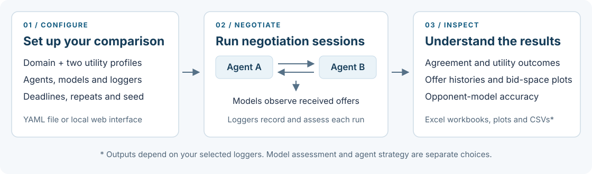

# NegoLog

**Build negotiation agents. Run tournaments. Understand their decisions.**

NegoLog is a **Python framework for bilateral automated negotiation and
opponent-model assessment**. Two agents negotiate over a domain, exchange offers,
and try to reach an agreement. You choose the strategies, preference profiles,
deadlines and analyses; NegoLog runs the sessions and produces inspectable logs
and plots.

[Start here](#quickstart) · [Usage guides](docs-source/README.md) ·
[Component catalog](docs-source/components.rst) ·
[IJCAI 2024 paper](https://www.ijcai.org/proceedings/2024/998) ·
[Cite NegoLog](#cite-negolog) · [Get help](#help-and-contributing)



## What can I do with NegoLog?

| Your task | What NegoLog provides | Start with |
| --- | --- | --- |
| Develop a negotiation agent | Bidding and acceptance interfaces, session management, and **26 bundled agents** | [Add an agent](docs-source/tutorials.rst#add-your-first-agent-module) |
| Study opponent preferences | **Nine opponent models**, true-profile assessment, and per-offer or final-session metrics | [Choose models and loggers](docs-source/components.rst) |
| Run a comparison | Configurable pairings, both role orders, repeated sessions, Excel summaries and plots | [Your first tournament](#quickstart) |
| Explore negotiation domains | Bundled discrete domains, a generator, profile editing and a local web interface | [Use the web interface](#web-interface) |

New to automated negotiation? An **issue** is a topic such as delivery time; a
**value** is one choice for that issue. A **bid** assigns a value to every issue.
Each agent's **utility profile** scores those bids. A **strategy** decides what
to offer or accept; an **opponent model** estimates the other side's preferences
from received offers.

> **Maintenance preview:** these instructions match
> [PR #2](https://github.com/aniltrue/NegoLog/pull/2), which is awaiting review.
> The clone command below selects that branch. Existing users should read the
> [migration checklist](MAINTENANCE.md#migration-quick-reference): preference APIs and
> several model and agent behaviors have changed since the original version.

## Quickstart

You need **Git and Python 3.10**. The dependency constraints and automated checks
target Python 3.10 on Linux, Windows and macOS. Installation needs internet
access; the bundled example runs locally on the CPU.

### 1. Get the code

```sh
git clone --branch maintenance/agent-model-framework-updates --single-branch https://github.com/aniltrue/NegoLog.git
cd NegoLog
```

Already viewing a checkout of this branch? Run the next commands from its root.

### 2. Install dependencies

#### macOS / Linux

```sh
python3.10 -m venv .venv
source .venv/bin/activate
python -m pip install -r requirements.txt
```

<!-- Expandable sections keep optional instructions readable; only their HTML tags need MD033 exceptions. -->
<!-- markdownlint-disable-next-line MD033 -->
<details>
<!-- markdownlint-disable-next-line MD033 -->
<summary><strong>Windows PowerShell commands</strong></summary>

```powershell
py -3.10 -m venv .venv
.\.venv\Scripts\Activate.ps1
python -m pip install -r requirements.txt
```

If activation is blocked, use `.\.venv\Scripts\python.exe` in place of `python`
for the install and run commands. No execution-policy change is required.

<!-- markdownlint-disable-next-line MD033 -->
</details>

### 3. Run your first tournament

```sh
python run.py tournament_configurations/quickstart.yaml
```

This runs **Boulware and Conceder in two sessions**, swapping their roles on
domain `0`: three issues, three values each, **27 possible bids**. Each session
has a **20-round limit**. Two opponent models observe the negotiations while
loggers record outcomes and estimation accuracy. The example checks your setup;
it does not establish a performance ranking.

**Expected result:** the terminal prints `Analysis have been completed.` and
`results/quickstart/results.xlsx` contains two outcome rows. The results folder
may open automatically in your file manager. A session can validly end without
agreement when its deadline is reached.

> Each run replaces its configured `result_dir`. Before rerunning, save the
> previous output or choose a new directory in the YAML configuration.

### 4. Read the results

| File in `results/quickstart/` | Use it to answer |
| --- | --- |
| `results.xlsx` | Which sessions reached agreement, and what utilities did the agents obtain? |
| `summary.xlsx` | How do outcomes aggregate for each agent? |
| `sessions/Boulware_Conceder_Domain0.xlsx` | What offers and model measurements led to this outcome? |
| `sessions/Conceder_Boulware_Domain0.xlsx` | What happened with the roles reversed? |
| `opponent model/` | How accurate were the estimated preferences? Open the summary workbook, metric plots and CSVs. |
| `domains.xlsx` | Which domain metadata accompanied this run? |

The [first-run guide](docs-source/getting-started.rst) walks through workbook
sheets and metric meanings. If a command fails, use
[troubleshooting](docs-source/troubleshooting.rst).

## Make it your experiment

Copy [quickstart.yaml](tournament_configurations/quickstart.yaml) to
`tournament_configurations/my_tournament.yaml`, change `result_dir`, then run:

```sh
python run.py tournament_configurations/my_tournament.yaml
```

Change one setting at a time:

| To… | Edit… |
| --- | --- |
| Compare other strategies | `agents`, using exact class names from the [catalog](docs-source/components.rst) |
| Try another domain | `domains`, using quoted identifiers such as `["0", "1"]` |
| Evaluate another estimator | `estimators`; use `[]` to omit models |
| Change the workload | `deadline_round`, `deadline_time` and `repeat`; at least one positive deadline is required |
| Select analyses | `loggers`; keep `BidSpaceLogger` with `TournamentSummaryLogger` |
| Export vector plots | `drawing_format: matplotlib-SVG` |

For `n` distinct agents, `d` domains and `r` repetitions, a tournament without
self-negotiation runs **`n × (n − 1) × d × r` sessions**. Start small: domain bid
spaces grow as the product of their issue sizes, and per-offer metrics add work.

**Model accuracy and agent performance answer different questions.** Listing a
model under `estimators` makes it observe offers; a strategy must explicitly use
that model to change its decisions. Evaluation loggers can access both true
profiles, while an agent receives its own profile.

Record the commit, YAML, profiles, dependency versions and seed with your
results. A seed helps reproduce random choices but does not guarantee identical
outcomes across all agents, machines or wall-clock deadlines. See the
[reproducibility checklist](docs-source/tutorials.rst#prepare-a-reproducible-study).

## Web interface

Prefer a visual workflow? From the repository root, in the same environment:

```sh
python app.py
```

Open **<http://127.0.0.1:5000>**. Browse domains, inspect profiles and bid spaces,
edit tournament settings, and monitor a run. The React build is bundled, so no
Node.js build is needed. Use `python app.py -p 5001` if port 5000 is occupied,
then open <http://127.0.0.1:5001>. Stop the server with `Ctrl+C`.


The [web walkthrough](docs-source/getting-started.rst#try-the-same-workflow-in-the-browser)
explains the controls. This is a local research interface: keep the development
server on loopback, use trusted configurations and plugins, and finish the active
tournament before starting another or modifying domains. Operational details
are in [running and storing experiments](docs-source/runs.rst).

## Learn and extend

| Next step | Guide |
| --- | --- |
| Understand the first run and its outputs | [Getting started](docs-source/getting-started.rst) |
| Write a YAML, add an agent module, sample metrics | [Practical tutorials](docs-source/tutorials.rst) |
| Choose bundled agents, models and loggers | [Component catalog](docs-source/components.rst) |
| Implement a preference estimator or interpret its scores | [Opponent-model API](docs-source/models.rst) |
| Add analysis callbacks and understand log sheets | [Logging API](docs-source/logging.rst) |
| Navigate the framework interfaces | [Core API](docs-source/api.rst) |
| Upgrade existing code or compare behavior across revisions | [Migration and validation notes](MAINTENANCE.md) |

The [documentation entry point](docs-source/README.md) explains how to browse
these guides on GitHub or build searchable HTML locally. The checked-in
[older HTML snapshot](docs/README.md) is retained for historical reference;
use `docs-source/` for this revision's guides and API.

## Cite NegoLog

If NegoLog supports your research, please cite our
[IJCAI 2024 Demo Track paper](https://www.ijcai.org/proceedings/2024/998):

**NegoLog: An Integrated Python-based Automated Negotiation Framework with
Enhanced Assessment Components** — Anıl Doğru, Mehmet Onur Keskin,
Catholijn M. Jonker, Tim Baarslag, and Reyhan Aydoğan. IJCAI 2024, pp. 8640–8643.
[DOI: 10.24963/ijcai.2024/998](https://doi.org/10.24963/ijcai.2024/998).

[Download BibTeX](CITATION.bib) · [Machine-readable citation](CITATION.cff)

<!-- Expandable sections keep optional instructions readable; only their HTML tags need MD033 exceptions. -->
<!-- markdownlint-disable-next-line MD033 -->
<details>
<!-- markdownlint-disable-next-line MD033 -->
<summary>Copy BibTeX</summary>

```bibtex
@inproceedings{ijcai2024p998,
  title     = {NegoLog: An Integrated Python-based Automated Negotiation Framework with Enhanced Assessment Components},
  author    = {Doğru, Anıl and Keskin, Mehmet Onur and Jonker, Catholijn M. and Baarslag, Tim and Aydoğan, Reyhan},
  booktitle = {Proceedings of the Thirty-Third International Joint Conference on
               Artificial Intelligence, {IJCAI-24}},
  publisher = {International Joint Conferences on Artificial Intelligence Organization},
  editor    = {Kate Larson},
  pages     = {8640--8643},
  year      = {2024},
  month     = {8},
  note      = {Demo Track},
  doi       = {10.24963/ijcai.2024/998},
  url       = {https://doi.org/10.24963/ijcai.2024/998},
}
```

<!-- markdownlint-disable-next-line MD033 -->
</details>

Also record the code revision used in your experiment. Individual agent and
model implementations retain their own references; cite the relevant original
methods when your work relies on them.

## Help and contributing

Start with [troubleshooting](docs-source/troubleshooting.rst). If the issue
persists, [open an issue](https://github.com/aniltrue/NegoLog/issues) with your
revision, environment, minimal configuration and traceback. The
[contribution guide](CONTRIBUTING.md) covers bug reports, documentation fixes,
new components, and the checks to run before a pull request.

## License and authorship

Copyright (C) 2024 Anıl Doğru & M. Onur Keskin & Reyhan Aydoğan.
Distributed under the [GNU General Public License, version 3](LICENSE), without
warranty. Agent and model implementations retain their attribution in the source.
