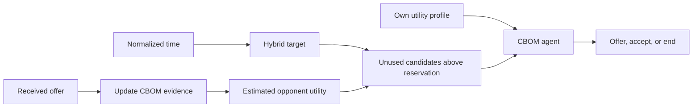

# CBOM for Java

Run the CBOM opponent model and negotiation strategy directly on the JVM. This
implementation uses the Java standard library; inference, candidate search, and
agent decisions run in Java. The JAR runs independently of Python and NegoLog.

The model follows the maintained CBOM implementation. The strategy combines the
published Algorithm 2 with documented initialization and finite-session rules.
It is a maintained implementation of the paper's method, not a recovered copy
of the original experiment executable or a GENIUS plug-in.

## Start in one minute

Requirements: **JDK 17 or newer** (`java`, `javac`, and `jar` on `PATH`). From the
repository root:

```sh
python java/build.py
java -jar java/build/cbom.jar demo --output outputs/java-demo.json
java -jar java/build/cbom.jar self-test
```

The demo negotiates between two CBOM agents using packaged synthetic profiles.
The JSON trace records each offer, acceptance, utility, target, candidate band,
and number of observations. It is a software example, not a paper result.

The build helper needs Python only to invoke JDK tools and copy resource files.
An already built JAR needs only a Java 17+ runtime. The `java/` directory is
self-contained and can be copied to another project without the Python package.
To compile without Python on macOS/Linux, run from `java/`:

```sh
mkdir -p build/classes
javac --release 17 -encoding UTF-8 -d build/classes src/org/cbom/*.java
cp -R data build/classes/
mkdir -p build/classes/META-INF
cp LICENSE NOTICE PSF-LICENSE build/classes/META-INF/
jar --create --file build/cbom.jar --main-class org.cbom.Main -C build/classes .
java -jar build/cbom.jar demo
```

PowerShell, from `java/`:

```powershell
New-Item -ItemType Directory -Force build/classes | Out-Null
javac --release 17 -encoding UTF-8 -d build/classes (Get-ChildItem src/org/cbom/*.java).FullName
Copy-Item data build/classes/ -Recurse -Force
New-Item -ItemType Directory -Force build/classes/META-INF | Out-Null
Copy-Item LICENSE,NOTICE,PSF-LICENSE build/classes/META-INF/
jar --create --file build/cbom.jar --main-class org.cbom.Main -C build/classes .
java -jar build/cbom.jar demo
```

## Choose a workflow

| Goal | Command or API |
| --- | --- |
| Run a complete local session | `java -jar java/build/cbom.jar demo` |
| Use your own profiles | Add `--profile-a PATH --profile-b PATH` |
| Work with large outcome spaces | `--search-mode sampled --sample-size 4096 --seed 0` |
| Learn from recorded offers | `learn --profile PATH --offers offers.jsonl` |
| Embed in Java | `Preference`, `ConflictBasedOpponentModel`, `CBOMAgent` |
| Drive a persistent agent externally | `java -jar java/build/cbom.jar serve` |
| Run native regression checks | `java -jar java/build/cbom.jar self-test` |



## Profile and offer files

Profiles use NegoLog's discrete additive schema. Issue weights must sum to one;
value utilities and reservation lie in `[0, 1]`. Issue/value insertion order is
preserved because it resolves ties.

```json
{
  "reservationValue": 0.2,
  "issueWeights": {"price": 0.6, "delivery": 0.4},
  "issues": {
    "price": {"low": 1.0, "high": 0.0},
    "delivery": {"now": 1.0, "later": 0.0}
  }
}
```

Every offer must contain exactly one valid value per issue. `learn` reads one
complete offer per line, for example:

```jsonl
{"price":"high","delivery":"later"}
{"price":"low","delivery":"later"}
{"price":"low","delivery":"now"}
```

```sh
java -jar java/build/cbom.jar learn --profile my-profile.json --offers offers.jsonl --output outputs/estimated.json
```

`learn` updates after every offer and exports the final estimated profile. Its
default `--history-size 1000` limits which earlier offers create new comparison
pairs; accumulated comparison evidence remains available after history expiry.

## Native Java API

Put `java/build/cbom.jar` on your application's classpath:

```java
import org.cbom.CBOMAgent;
import org.cbom.Json;
import org.cbom.Preference;
import java.nio.file.Files;
import java.nio.file.Path;
import java.util.Map;

Preference own = Preference.fromMap(Json.parse(Files.readString(Path.of("my-profile.json"))));
CBOMAgent agent = new CBOMAgent(own, Json.map("mode", "auto", "seed", 0));
CBOMAgent.Action opening = agent.act(0.0);
agent.receive(Map.of("price", "high", "delivery", "later"), 0.1);
CBOMAgent.Action response = agent.act(0.1);
System.out.println(Json.stringify(response.toMap()));
```

`agent.model` exposes the actively updated opponent model, including
`preference()`, `observations()`, `comparisons()`, `evidenceCells()`, and `state()`.
Use `new ConflictBasedOpponentModel(own)` directly for model-only applications.

Call `receive` exactly once per received offer. Time must be nondecreasing and
normalized to `[0, 1]`. A counteroffer expires the preceding received offer;
repeated `act` callbacks cannot accept that stale offer. An `accept` or `end`
action terminates the agent. Instantiate another agent for the next session.

## Persistent JSON-lines protocol

Start `java -jar java/build/cbom.jar serve`. Write one JSON request per line to
stdin and read one JSON response from stdout. The process retains its agent
between requests. No log messages are mixed into protocol stdout.

| Operation | Request fields | Successful `result` |
| --- | --- | --- |
| `init` | `profile`, optional `options` | Initial model state; resets the session |
| `receive` | `bid`, `t` | Updated model state |
| `act` | `t` | Action including selection evidence |
| `inspect` | None | Current model state |
| `close` | None | `null`, then process exits |

Example request sequence (replace `profile` with the full profile object):

```jsonl
{"op":"init","profile":{"issueWeights":{"x":1},"issues":{"x":{"a":1,"b":0}}},"options":{"mode":"exact"}}
{"op":"act","t":0}
{"op":"receive","bid":{"x":"b"},"t":0.2}
{"op":"act","t":0.2}
{"op":"inspect"}
{"op":"close"}
```

Responses use `{"ok":true,"result":...}`. For `act`, `action` is also provided
as an alias of `result`. An action has `kind`, `bid`, `own_utility`, `target`,
`selection`, and `reason`. End actions have no bid. `selection` records
`bid`, `own_utility`, `opponent_utility`, `epsilon`, `candidate_count`, and `exact`.

Errors use `{"ok":false,"error":"...","error_type":"..."}`. Malformed
requests do not terminate the process. Invalid bids, times, or initialization
options preserve the previous model/session. A terminal session must be reset
with `init` before further agent events.

Available `options`: `p0`, `p1`, `p2`, `p3`, `epsilon`, `model_threshold`,
`history_size`, `mode`, `max_exact_outcomes`, `sample_size`, and integer `seed`.
Defaults match Python: `0.9`, `0.7`, `0.4`, `0.5`, `0.02`, `3`, `1000`, `auto`,
`50000`, `4096`, and `0`. Positive integer options are bounded to Java's 32-bit
integer range; seeds accept arbitrarily large positive or negative integers.

## Cross-language behavior and limits

Both implementations use the same accumulated CBOM evidence, previous-belief
interpretation, rank-sum utility estimation, Hybrid concession equations,
reservation checks, candidate selection, and acceptance policy. The Java port
implements Python-compatible integer-seeded MT19937 sampling, including draw
order and duplicate elimination. It does not substitute `java.util.Random`.

CBOM majority comparisons can be cyclic: a comparison function does not always
define a mathematical total order. Sorting choices therefore matter. Java
preserves **CPython 3.10.20's TimSort comparison and merge schedule**, matching
the Python version supported by NegoLog. This includes long rankings, merge
galloping, ties and cycles; there is no 63-element input limit.

The regression suite checks 312 frozen CPython 3.10 sorting cases, including
the exact comparison sequence, and complete model histories with long rankings.
`examples/long-ranking-example.json` preserves an 80-value counterexample that
revealed an earlier insertion-only port error; the full TimSort port matches
the Python 3.10 model on this history. Tests also cover a sampled `50^10`-outcome
domain. Arithmetic comparisons allow `1e-14` absolute utility error; selected
actions and discrete model states must match exactly in the stated parity tests.

Python versions with a different sorting implementation may resolve a cyclic
ranking differently, even on short lists: the Python 3.14 CI run exposed
differences below 64 elements as well as in strategy decisions. Use CPython 3.10
when comparing Python and Java runs. Java pins this reference instead of depending
on the JDK's comparator sort. Frozen Python 3.10 protocol responses are replayed
on every tested Python/JDK combination; live differential tests run on 3.10.
Record the Python version when comparing languages;
unrestricted cross-version bitwise identity is not claimed. Sampled search
remains an explicit approximation to candidate search, with no global optimum
guarantee.

From the repository root, run the differential suite with a JDK on `PATH`:

```sh
CBOM_REQUIRE_JAVA=1 python -m pytest tests/test_java_parity.py tests/test_java_long_order.py -q
```

In PowerShell set `$env:CBOM_REQUIRE_JAVA = "1"` first. This flag makes a missing
JDK fail the suite instead of skipping Java tests. CI installs supported JDKs
explicitly. See the main repository documentation for full Python/framework
integration commands and the original experiment reproduction limitations.

## Attribution and citation

This Java implementation is part of CBOM and is licensed under GPL-3.0; see the
included `LICENSE`. CBOM derives from the maintained public NegoLog V2 model by
Mehmet Onur Keskin and collaborators. The native engine was written for this
package. `StableOrder.java` adapts CPython 3.10.20's TimSort comparison schedule;
its source attribution and preserved license are in the file header and
`PSF-LICENSE`. Integer-seeded MT19937 compatibility and accurate summation follow
the behavior of CPython's `random` module and `math.fsum`. The JAR includes the
license and attribution files under `META-INF/`.

When using the method, cite:

> Mehmet Onur Keskin, Berk Buzcu, and Reyhan Aydoğan. “Conflict-based negotiation
> strategy for human-agent negotiation.” *Applied Intelligence* 53,
> 29741–29757 (2023). DOI: [10.1007/s10489-023-05001-9](https://doi.org/10.1007/s10489-023-05001-9).

Record the software version, language, search mode, seed, history limit, and
strategy settings with your experiment. If rankings have 64 or more elements,
also record the runtime/Python version because cycle resolution is relevant.
