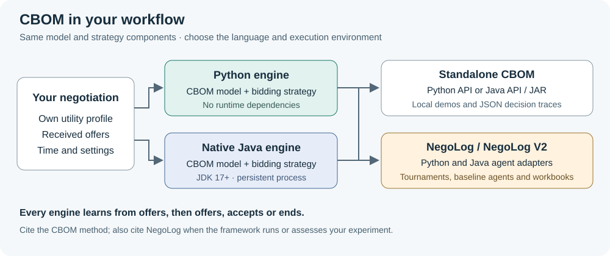

CBOM agents in Python and Java
==============================

CBOM learns the opponent's preferences from received offers and uses that model
to choose its next offer. This integration adds two selectable agent entries:
``CBOMAgent`` runs Python; ``CBOMJavaAgent`` runs the native Java implementation.
Both are maintained implementations of the strategy associated with
`Conflict-based negotiation strategy for human-agent negotiation
<https://doi.org/10.1007/s10489-023-05001-9>`_.

Run Python first
----------------

Complete the :doc:`getting-started` installation, then from the repository root:

.. code-block:: sh

   python run.py tournament_configurations/cbom-python.yaml

This runs CBOM and Boulware in both roles on domain ``0``, with a 30-round limit.
No Java installation or separate CBOM checkout is needed. Read
``results/cbom-python/results.xlsx`` and the session files. Outcome utilities
are functional example outputs, not evidence that one strategy is better.

Enable Java and compare both implementations
---------------------------------------------

Install a JDK version 17 or newer and make both ``java`` and ``javac`` available
on your command path. A JRE alone cannot compile source. Build once before
running any timed sessions:

.. code-block:: sh

   java -version
   javac -version
   python agents/CBOM/java/build.py
   python run.py tournament_configurations/cbom.yaml

The configuration runs six sessions: Python CBOM, Java CBOM and Boulware, with
both role orders. The workbook names use ``CBOM`` and ``CBOMJava``. Inspect
``results/cbom/results.xlsx``, ``summary.xlsx`` and ``sessions/``. Each run
replaces its configured output directory; change ``result_dir`` to keep it.

For a single session:

.. code-block:: sh

   python examples/cbom_session.py --agent-a python --agent-b java --domain 0 --rounds 30 --output results/cbom-session.xlsx

Use ``--agent-b boulware`` or ``--agent-b conceder`` for an existing opponent.
The Python framework manages sessions and logs. The Java process keeps its own
CBOM model and chooses actions; Python only translates the protocol. Importing
the framework or running Python agents does not start a JVM.

Run without the framework
-------------------------

The bundled engines also run standalone from this checkout:

.. code-block:: sh

   python examples/cbom_standalone.py demo --output results/cbom-standalone-python.json
   java -jar agents/CBOM/java/build/cbom.jar demo --output results/cbom-standalone-java.json

The independent `CBOM paper-code repository <https://github.com/monurkeskin/CBOM>`_
has the same engines, model-only examples, a Java API/protocol guide and the
method provenance. Its Python engine and the standalone wrapper have no runtime
dependencies; the wrapper can run without installing the framework.

Configure the strategy
----------------------

Select ``CBOMAgent`` or ``CBOMJavaAgent`` under ``agents`` in YAML. Their CBOM
model updates internally on every received offer. Adding a model under
``estimators`` only adds assessment and does not replace that internal model.

For custom settings, define an importable subclass in your own module:

.. code-block:: python

   from agents import CBOMAgent

   class SampledCBOM(CBOMAgent):
       cbom_options = {"mode": "sampled", "sample_size": 8192, "seed": 42}

Use its full import path in YAML. ``CBOMJavaAgent`` accepts the same strategy
options through ``cbom_options``. Its ``java_executable`` and ``java_jar`` class
attributes can select a JDK executable and prebuilt JAR; build before running.
Keep the repository JAR and source versions together.

Default candidate search is exact up to 50,000 outcomes and sampled above that.
Sampling limits the candidate pool, not the CBOM update. NegoLog's own domain
loading and selected loggers can still enumerate large outcome spaces. Record
language, domain order, search mode, seed and both code versions. Java follows
CPython 3.10's TimSort for cyclic rankings. Use Python 3.10 for cross-language
comparisons: newer Python sorting implementations can differ even on short cyclic
rankings. The Java guide documents the tested parity scope; these tests are not
an all-domain identity proof.

Understand session endings
--------------------------

CBOM may return ``EndNegotiation`` when the deadline is reached, no outcome meets
reservation utility, or its unused candidate pool is exhausted. Session logs
record an ``End`` action, ``EndReason`` and the acting party. The tournament
retains the existing ``Result = Failed`` category for no agreement; this is not
an agent exception. Reservation utilities are recorded for that outcome.
Replay does not treat an end action as an offer or try to learn from a missing bid.

A counteroffer declines the previous received offer. A later callback cannot
accept that old offer unless the opponent sends it again. The framework closes
the Java process when the session terminates; a failed Java request reports an
error instead of silently switching languages.

Troubleshooting
---------------

.. list-table::
   :header-rows: 1
   :widths: 35 65

   * - Symptom
     - Action
   * - Java executable or compiler not found
     - Install a JDK 17+ and check both commands in the same terminal used to run NegoLog.
   * - CBOM JAR missing
     - Run ``python agents/CBOM/java/build.py`` before starting the tournament.
   * - Java session fails during startup
     - Read the recorded exception; check the JAR path, JDK version and profile. Do not reuse a failed agent instance.
   * - No agreement or early end
     - Read ``EndReason``, reservation values and candidate coverage before treating it as a bug.
   * - Large domain is still expensive
     - Account for framework bid enumeration and analysis cost, not just the CBOM search mode.

Cite both contributions when applicable
---------------------------------------

Cite `Keskin, Buzcu and Aydoğan (2023)
<https://doi.org/10.1007/s10489-023-05001-9>`_ for the CBOM method and
`Doğru et al. (2024) <https://doi.org/10.24963/ijcai.2024/998>`_ for NegoLog when
using it to run or assess experiments. CBOM BibTeX and source attribution are
bundled in ``agents/CBOM/_vendor/``; NegoLog's preferred framework citation is
unchanged. The maintained method includes documented differences from the
published model and does not reproduce the original human-study environment.
