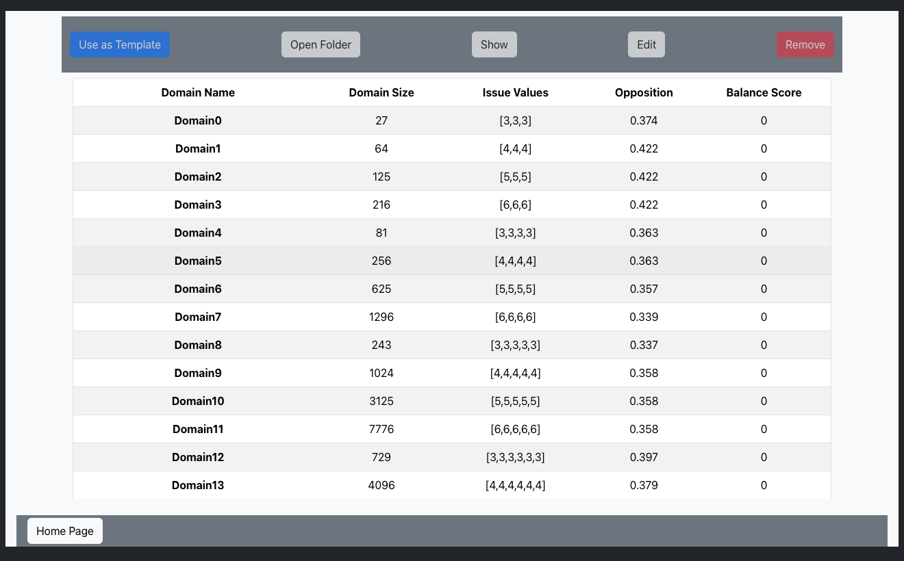

Your first negotiation tournament
=================================

By the end of this guide, you will have run two agents, opened their individual
offer histories, and read the opponent-model scores. No dataset download,
GPU, account, or Node.js installation is needed.

.. contents:: On this page
   :local:
   :depth: 2

1. Get the matching code
------------------------

These instructions describe **NegoLog V2 (2.1.0)**. Clone the V2 repository
to get the quickstart and APIs shown here:

.. code-block:: console

   git clone https://github.com/aniltrue/NegoLog.git
   cd NegoLog

Already have a checkout? Use the revision that supplied these documentation
pages, and run all commands below from its repository root. Existing experiments
should retain their original checkout and environment; read the
:download:`migration guide <../MAINTENANCE.md>` when updating.

2. Install Python dependencies
------------------------------

Use **Python 3.10**. The repository's dependency constraints and automated
Linux, Windows, and macOS checks target that interpreter. Installation requires
internet access; the example itself runs locally on the CPU.

macOS or Linux
~~~~~~~~~~~~~~

.. code-block:: console

   python3.10 -m venv .venv
   source .venv/bin/activate
   python -m pip install -r requirements.txt

Windows PowerShell
~~~~~~~~~~~~~~~~~~

.. code-block:: powershell

   py -3.10 -m venv .venv
   .\.venv\Scripts\Activate.ps1
   python -m pip install -r requirements.txt

If PowerShell blocks activation, use the environment's interpreter directly;
no execution-policy change is required:

.. code-block:: powershell

   .\.venv\Scripts\python.exe -m pip install -r requirements.txt
   .\.venv\Scripts\python.exe run.py tournament_configurations/quickstart.yaml

For the remaining examples, ``python`` means the interpreter from this
environment. Confirm it before your first run:

.. code-block:: console

   python -c "import sys, nenv; print(sys.executable); print(sys.version); print(nenv.__file__)"

The printed interpreter should belong to ``.venv`` and the library path should
point to this checkout's ``nenv`` folder. If a command fails, use
:doc:`troubleshooting` before changing dependencies.

3. Run the included example
---------------------------

.. code-block:: console

   python run.py tournament_configurations/quickstart.yaml

The configuration runs Boulware and Conceder on domain ``0``, whose three
three-value issues create 27 possible bids. Two sessions swap which agent starts
and receives profile A. Each session has a 20-round limit. Bayesian and CUHK
Frequency models observe offers; the loggers assess them against the known
profiles. This is an installation and workflow example, not a benchmark ranking.

Successful completion prints ``Analysis have been completed.`` and creates
``results/quickstart/results.xlsx`` with **two outcome rows**. The CLI may open
the results folder in your desktop file manager. Initial dependency imports and
plot generation contribute to elapsed runtime.

.. important::

   A tournament replaces its configured ``result_dir``. The example uses
   ``results/quickstart``. Change that path or copy the existing results before
   running it again, including when starting it from the web interface.

4. Read the results
-------------------

.. code-block:: text

   results/quickstart/
   ├── results.xlsx                 ← Start here: one outcome per session
   ├── summary.xlsx                 ← Per-agent summaries
   ├── domains.xlsx                 ← Metadata for the selected domain
   ├── results_backup.xlsx          ← Before tournament-level analysis
   ├── sessions/
   │   ├── Boulware_Conceder_Domain0.xlsx
   │   └── Conceder_Boulware_Domain0.xlsx
   └── opponent model/
       ├── estimator_summary.xlsx   ← Final model scores
       └── ...                      ← Metric curves and CSV data

Open the workbooks in a spreadsheet application, or save the following as
``inspect_results.py`` in the repository root and run
``python inspect_results.py``:

.. code-block:: python

   from pathlib import Path

   import pandas as pd

   output = Path("results/quickstart")
   outcomes = pd.read_excel(output / "results.xlsx", sheet_name="TournamentResults")
   print(outcomes[["AgentA", "AgentB", "Result", "Round",
                   "AgentAUtility", "AgentBUtility"]].to_string(index=False))

   session_file = output / "sessions" / "Boulware_Conceder_Domain0.xlsx"
   offers = pd.read_excel(session_file, sheet_name="Session")
   print(offers[["Round", "Who", "Action", "AgentAUtility", "AgentBUtility"]].head())

   scores = pd.read_excel(output / "opponent model" / "estimator_summary.xlsx")
   print(scores.to_string(index=False))

What the columns mean
~~~~~~~~~~~~~~~~~~~~~

.. list-table::
   :header-rows: 1
   :widths: 29 71

   * - Column or sheet
     - Interpretation
   * - ``AgentA``, ``AgentB``
     - A receives profile A and makes the first offer; B receives profile B.
   * - ``Result``
     - ``Acceptance`` is an agreement. ``Failed`` means the negotiation reached
       its deadline without agreement. ``Error`` and ``TimedOut`` identify agent
       execution problems; inspect terminal output and ``Who``.
   * - ``Round``, ``Time``, ``ElapsedTime``
     - Rounds start at zero. ``Time`` is the normalized deadline fraction;
       ``ElapsedTime`` is seconds. They are different quantities.
   * - ``AgentAUtility``, ``AgentBUtility``
     - The outcome valued under each side's true profile. A normal ``Failed``
       session records the reservation utilities.
   * - ``ProductScore``, ``SocialWelfare``
     - The product and sum of those two utilities.
   * - ``FilePath``
     - The session workbook associated with an outcome. Repeated pairings get
       distinct names ending in ``_repeat2``, ``_repeat3``, and so on.
   * - ``summary.xlsx``
     - ``Summary`` covers all outcomes; ``Summary Acceptance`` covers agreements;
       ``Summary without Error`` excludes ``Error`` and ``TimedOut``. Check
       ``Count`` and outcome rates before comparing average utilities.
   * - ``Avg.RMSE``
     - Mean final utility-estimation error across evaluated agent sides. Lower
       means closer utility predictions for this sample.
   * - ``Avg.Spearman``, ``Avg.KendallTau``
     - Mean final rank correlations. Higher means closer ordering of the same
       bids. Ties are retained; a constant estimate can produce undefined
       ``NaN`` values.

Model scores assess the estimates, not the bidding policy. Attaching an
estimator does not automatically make an agent use its estimate to choose offers.
The example is too small to support claims about general agent or model quality.

5. Try the same workflow in the browser
---------------------------------------

With the same Python environment, start the local server:

.. code-block:: console

   python app.py

Open http://127.0.0.1:5000 and follow this path:

1. Select **Run Tournament** on the home page.
2. Select **quickstart** and inspect its agents, domain, deadlines, and output
   directory before starting it.
3. Start the selected configuration, then use **Monitor Tournament** to follow
   progress and open its result directory.
4. Use **Show Domains** to inspect existing profiles and bid spaces. Use
   **Create Tournament** when ready to make your own configuration.

   The domain browser lists the profiles available for tournament configuration.

The bundled React interface is already built. Run ``app.py`` from the repository
root; do not open ``web_framework/index.html`` directly or run ``npm install``.
To use another port, run ``python app.py -p 5001`` and open
http://127.0.0.1:5001. Stop the server with ``Ctrl+C``.

One tournament can run at a time in the web process. Finish it before editing
domains or starting another run. The interface is a local desktop research tool;
use its loopback address. Details about cancellation and domain saving are in
:doc:`runs`.

Where to go next
----------------

* :doc:`tutorials`: change a YAML configuration, register your first component,
  and choose the cost of model assessment.
* :doc:`components`: choose among the built-in agents, models, and loggers.
* :doc:`troubleshooting`: resolve installation, configuration, and output issues.
* :doc:`api`: look up the Python interfaces after a successful first run.
